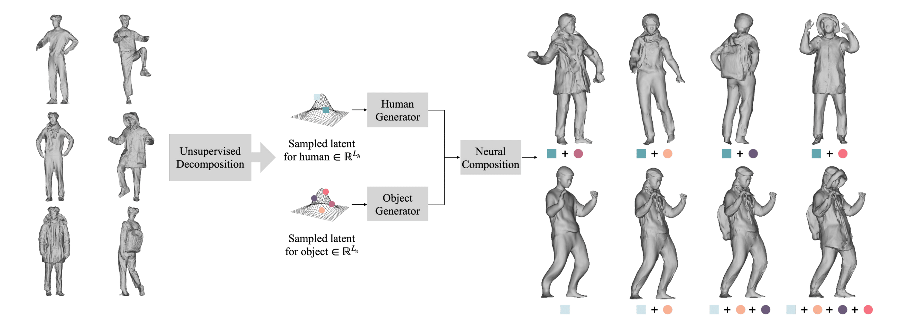

# NCHO

## [Project Page](https://taeksuu.github.io/ncho/) &nbsp;|&nbsp; [Paper](https://arxiv.org/pdf/2305.14345.pdf) 

This is the official code for the ICCV 2023 paper "NCHO: Unsupervised Learning for Neural 3D Composition of Humans and Objects", a a novel framework for learning a compositional generative model of humans and objects (backpacks, coats, scarves, and more) from real-world 3D scans.
