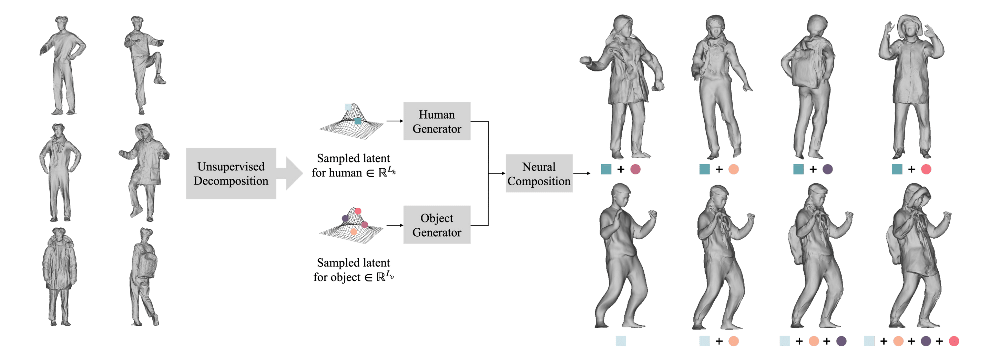

# NCHO (ICCV 2023)

## [Project Page](https://taeksuu.github.io/ncho/) &nbsp;|&nbsp; [Paper](https://arxiv.org/pdf/2305.14345.pdf) 



This is the official code for the ICCV 2023 paper "NCHO: Unsupervised Learning for Neural 3D Composition of Humans and Objects", a novel framework for learning a compositional generative model of humans and objects (backpacks, coats, scarves, and more) from real-world 3D scans.

## Installation
Setup the environment using conda.
```
conda env create -f environment.yaml
conda activate ncho
```

## Dataset
We provide our captured raw 3D scans and the corresponding SMPL parameters used in the paper. Folder "200" contains scans of the person without any object. Other folders contain scans of the same person with many different objects.

### Agreement
The NCHO dataset is available for non-commercial research purposes only. Any other use, in particular any use for commercial purposes, is prohibited.
